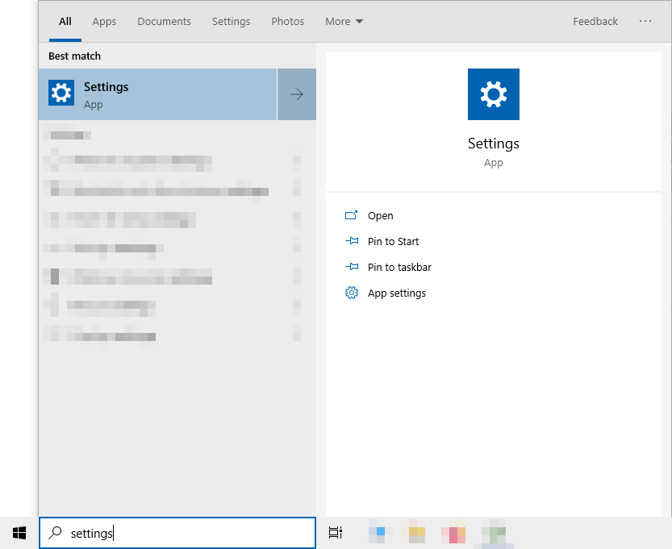

<h1 align="center" style="font-weight: bold">
    INSTALLATION
</h1>

## **Table of Contents**

- [**Windows 7 and up**](#windows)
- [**Mac**](#mac)
- [**Linux**](#linux)
    - [**Arch-based distros**](#arch-based-distros)
    - [**Debian-based distros**](#debian-based-distros)
    - [**CentOS 8 (and newer), Fedora, and Red Hat-based distros**](#centos-8-and-newer-fedora-and-red-hat-based-distros)
    - [**CentOS 6 and 7, and older versions of Red Hat-based distros**](#centos-6-and-7-and-older-versions-of-red-hat-based-distros)
- [**Credits**](#credits)

## [Windows 7 and up](https://www.microsoft.com/en-us/windows)

Part of the following is a summary of [this](https://community.chocolatey.org/courses/installation/installing?method=installing-chocolatey) guide, modified to fit accordingly.

- Press <kbd>Win</kbd>. An interface shoud pop up as shown below:

    

- Search for settings by typing "`Settings`" in the text field as shown below:

    

    Press <kbd>Enter</kbd>.

- A window should pop up as shown below:

    

    Press "`Apps`" in the selection below.

- You should be redirected to "`Apps & Features`" as shown below:

    

    Below the subtitle "`Apps & Features`", press the hyperlink "`App execution aliases`".

- You should be redirected to "`App execution aliases`" as shown below:

    

    Toggle the "`App installer`" for both "`python.exe`" and "`python3.exe`".
    Exit the settings app.

- Press <kbd>Windows</kbd> + <kbd>R</kbd> (Press <kbd>Windows</kbd> and <kbd>R</kbd> keys simultaneously)

- A window with a title `Run` should appear. Focus to the said window and type `cmd.exe` in the `Open:` text field like illustrated below:

    

- Press <kbd>Ctrl</kbd> + <kbd>Shift</kbd> + <kbd>Enter</kbd> (Press <kbd>Ctrl</kbd>, <kbd>Shift</kbd>, and <kbd>Enter</kbd> keys simultaneously).

- A window with a title `Command Prompt` should appear. Focus to the said window and run the following command:

    ```cmd
    @"%SystemRoot%\System32\WindowsPowerShell\v1.0\powershell.exe" -NoProfile -InputFormat None -ExecutionPolicy Bypass -Command "iex ((New-Object System.Net.WebClient).DownloadString('https://community.chocolatey.org/install.ps1'))" && SET "PATH=%PATH%;%ALLUSERSPROFILE%\chocolatey\bin"
    ```

- After the command has finished running, install the rest of the prerequisites by running the following command:

    ```
    choco install python
    choco install git -params '"/GitAndUnixToolsOnPath"'
    choco install 7zip.install
    ```

- And you're done! Proceed now to [setup](README.md#setup) to install this project.

## [Mac](https://www.apple.com/mac/)

The following is a summary of [this](https://docs.python-guide.org/starting/install3/osx/) guide, modified to fit accordingly.

- Open your preferred terminal

- Install homebrew using the following command:

    ```bash
    /bin/bash -c "$(curl -fsSL https://raw.githubusercontent.com/Homebrew/install/master/install.sh)"
    ```

- After installation, add the following line to your `~/.profile` file:

    ```
    export PATH="/usr/local/opt/python/libexec/bin:$PATH"
    ```

    or for OS X 10.12 (Sierra) or older, use the following line instead:

    ```
    export PATH=/usr/local/bin:/usr/local/sbin:$PATH
    ```

- After that, install the rest of the prerequisites by running the following command:

    ```
    brew install python
    brew install git
    brew install p7zip
    ```

- And you're done! Proceed now to [setup](README.md#setup) to install this project.

## [Linux](https://www.linux.org/)

Part of the following is a summary of the following guides, modified to fit accordingly:

- [Install pip on Linux](https://linuxconfig.org/install-pip-on-linux)
- [Download for Linux and Unix](https://git-scm.com/download/linux)

### [Arch](https://archlinux.org/)-based distros

- Open your preferred terminal and run the following command:

    ```
    sudo pacman -Syyu
    sudo pacman -S python3
    sudo pacman -S python-pip
    sudo pacman -S git
    sudo pacman -S p7zip
    ```

- And you're done! Proceed now to [setup](README.md#setup) to install this project.

### [Debian](https://www.debian.org/)-based distros

- Open your preferred terminal and run the following command:

    ```
    sudo apt-get install software-properties-common
    sudo add-apt-repository ppa:deadsnakes/ppa
    sudo apt-get update
    sudo apt-get install python3.9
    sudo apt install python3-pip
    sudo apt install git-all
    sudo apt-get install p7zip-full
    ```

- And you're done! Proceed now to [setup](README.md#setup) to install this project.

### [CentOS](https://www.centos.org/) 8 (and newer), [Fedora](https://getfedora.org/), and [Red Hat](https://www.redhat.com/en)-based distros

- Open your preferred terminal and run the following command:

    ```
    sudo dnf install https://dl.fedoraproject.org/pub/epel/epel-release-latest-8.noarch.rpm
    sudo dnf install python3
    sudo dnf install git-all
    sudo dnf install p7zip p7zip-plugins
    ```

- And you're done! Proceed now to [setup](README.md#setup) to install this project.

### [CentOS](https://www.centos.org/) 6 and 7, and older versions of [Red Hat](https://www.redhat.com/en)-based distros

- Open your preferred terminal and run the following command:

    ```
    sudo yum update
    sudo yum install epel-release
    sudo yum install centos-release-scl
    sudo yum install rh-python39
    sudo yum install epel-release
    sudo yum install python-pip
    sudo yum install git
    sudo yum install p7zip
    ```

- And you're done! Proceed now to [setup](README.md#setup) to install this project.

## **Credits**

Part of the guide above is a summary of the following articles, guides, and/or tutorials, modified to fit accordingly:

- <a target="_blank" href="https://community.chocolatey.org/courses/installation/installing?method=installing-chocolatey">Installing Chocolatey
</a>

- <a target="_blank" href="https://docs.python-guide.org/starting/install3/osx/">Installing Python 3 on Mac OS X
</a>

- <a target="_blank" href="https://linuxconfig.org/install-pip-on-linux">Install pip on Linux
</a>

- <a target="_blank" href="https://git-scm.com/download/linux">Git Download for Linux and Unix
</a>

<sub>
    <i>
        <b>NOTE:</b> If a reference or source material is not attributed properly or not at all, please kindly message me at Discord: <a target="_blank" href="https://discord.com/users/867696753434951732">whi_ne#5135</a> (or create a pull request, but at the moment there are no template for pull request so creating one I suppose would be hard) so I can properly give credit to their respective authors.
    </i>
</sub>
