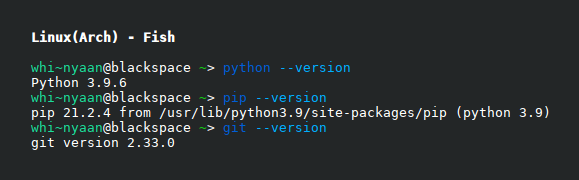

<!-- Repository Name. Preferrably 1-5 words long. -->
<h1 align="center" style="font-weight: bold">
    mangDL
</h1>

<!-- Description. Preferrably 1 sentence long. -->
<h3 align="center" style="font-weight: bold">
    WIP: Manga Downloader (and soon, a reader too)
</h3>

<p align="center">
	<a href="https://github.com/whinee/mangdl/blob/master/LICENSE.md">
        
    </a>
    <a href="https://github.com/whinee/mangdl/issues">
        
    </a>
    <a href="https://github.com/whinee/mangdl/network/members">
        
    </a>
    <a href="https://github.com/whinee/mangdl/network/members">
        
    </a>
    <a href="https://github.com/whinee/mangdl/graphs/contributors">
        
    </a>
</p>

<!-- About section. Preferrably 2-5 sentences long. -->
---

<h4 align="center">
Hewwwoooooo, whi~nyaan created a manga downloader for you. Now, give whi~nyaan lotsa hugs 'n pats. Now!

Whi~nyaan seems to forget something that is needed to be fixed tho', so please, do not use it yet.

Whi~nyaan is super ashamed of this, but just wait for whi~nyaan shall fix this mess nyaan~
</h4>

<h6 align="center">

<!-- NOTE: If this project is out of the testing phase, comment the line below. -->
This project is still in testing phase so please expect a lot of bugs.

<!-- Update the python version and OS if changed during the testing and/or development of this repository. -->
Developed and tested in Python 3.10.0, Arch Linux 5.14.14-arch1-1.

<!-- Can be omitted if the About section is too long. -->
<!-- This project is not guaranteed to run in other operating systems, however compatibility is being kept in mind when creating this. -->

</h6>

---

<!-- TOC section. Update when adding sections and subsections fitted in TOC. -->
## **Table of Contents**

- [**Table of Contents**](#table-of-contents)
- [**Usage**](#usage)
- [**Getting Started**](#getting-started)
    - [**Prerequisites**](#prerequisites)
    - [**Setup**](#setup)
- [**TODO**](#todo)
- [**FAQs**](#faqs)
- [**Contributions**](#contributions)
- [**Known Issues and Limitations**](#known-issues-and-limitations)
- [**Future of this project**](#future-of-this-project)
- [**License**](#license)
- [**Credits**](#credits)

<!-- Mention examples of application of this repository. -->
## **Usage**

```bash
mangdl -h
```

Downloading:

```bash
mangdl dl <title> [OPTIONS]
```

## **Getting Started**

These instructions will get you a copy of the project up and running on your local machine for development and testing purposes.

### **Prerequisites**

The following are the required programs and/or packages to run this project:

- For all operating systems:
    - Python 3.6 and higher
        <details>
        <summary>To check that you have Chocolatey installed, in your preffered terminal, run the following command:</summary>

        ```bash
        python3 --version
        ```

        </details>

    - pip (Package Installer for Python)
        <details>
        <summary>To check that you have Chocolatey installed, in your preffered terminal, run the following command:</summary>

        ```bash
        pip3 --version
        ```

        </details>

    - git
        <details>
        <summary>To check that you have Chocolatey installed, in your preffered terminal, run the following command:</summary>

        ```bash
        git --version
        ```

        </details>

    

- For windows:
    - [Chocolatey](https://chocolatey.org)
        <details>
        <summary>To check that you have Chocolatey installed, in your preffered terminal, run the following command:</summary>

        ```bash
        choco --version
        ```

        </details>

    - [7zip](https://7-zip.org)
        <details>
        <summary>To check that you have Chocolatey installed, in your preffered terminal, run the following command:</summary>

        ```bash
        7z --version
        ```

        </details>

    

- For [macOS](https://www.apple.com/mac/):
    - [Homebrew](https://brew.sh)
        <details>
        <summary>To check that you have Chocolatey installed, in your preffered terminal, run the following command:</summary>

        ```bash
        brew --version
        ```

        </details>

    

If any or all of the above is not installed, follow [this link](python_install.md):

After checking or installing Python, pip, and git in your machine, proceed to the [setup](#setup) section.

### **Setup**

- Open your preferred console or terminal

- Clone this repository and create a virtual environment using the following command:

    ```bash
    git clone https://github.com/whinee/mangdl.git
    cd mangdl
    python3 -m venv venv
    ```

    You should get a similar output like the following image:
    

- Setup a virtual environment
    - For [Windows 7 and up](https://www.microsoft.com/en-us/windows):
        - For `cmd`, run the following command:

            ```bash
            venv\Scripts\activate.bat
            ```

        - For `powershell`, run the following command:

            ```bash
            venv\Scripts\activate.ps1
            ```

        - For `powershell core`, run the following command:

            ```bash
            venv/bin/Activate.ps1
            ```

    - For [Mac](https://www.apple.com/mac/)/[Linux](https://www.linux.org/)
        - For `bash/zsh`, run the following command:

            ```bash
            source venv/bin/activate
            ```

        - For `fish`, run the following command:

            ```bash
            source venv/bin/activate.fish
            ```

        - For `csh/tcsh`, run the following command:

            ```bash
            source venv/bin/activate.csh
            ```

- Install the python dependencies by running the following command in your preffered terminal:

    ```bash
    python3 -m pip install git+https://www.github.com/whinee/mangdl
    python3 -m pip install --upgrade pip
    python3 -m pip cache purge
    ```

- And you're done! You can now use the project. Check the [usage](#section) for examples on how to use this project.

# TODO

### Main to do

[ ] Library

- [ ] Manga Update notifier

[ ] GUI

- [ ] Reader

[ ] MAL / Anilist sync

### Side Quests

[ ] Package update notifier

[ ] Saving command options to config file

[ ] Submission of new color theme

[ ] Returning/Downloading translated languages using locale of the machine and an option to override it

### Done

#### Main to do

#### Side Quests

## **FAQs**

**Q. How to contact you?**

*A. Thru discord, friend requests are accepted but is not required.*

Discord Account: **<a target="_blank" href="https://discord.com/users/867696753434951732">\S#5135</a>**

## **Contributions**

You can contribute by creating a new issue, or by creating pull requests.

At the time of writing, there are no templates for both creating a new issue and pull requests.

The developer notes however that the said template will be created if a trend of users using this project is evident.

For creating a new issue, please make sure that the said issue is not on the list of closed and open issues.

After checking that that is the case, create a new issue.

The title of the issue must summarize its contents.

The body must contain the following:

- a clear description of the bug
- Python version used for running and/or testing the project
- OS name and version

<!-- Mention the issus and limitations of this repository. Preferrably 1-5 sentences long. -->
## **Known Issues and Limitations**

Something is broken and I don't know what is, 'cause I forgot!

<!-- Mention the plans for the repository. Preferrably 2-5 sentences long. -->
## **Future of this project**

The TODO will be done, except for that, nothing else.

<!-- License section. Leave unchanged except when updating the year, using a different license, or changing the style altogether. -->
## **License**

### <a target="_blank" href="https://choosealicense.com/licenses/mit/">MIT</a>

Copyright for portions of project [mangDL](https://github.com/whinee/mangdl) are held by [Github Account [justfoolingaround](https://github.com/justfoolingaround) Owner, 2021] as part of project [animDL](https://github.com/justfoolingaround/animDL).

All other copyright for project [mangDL](https://github.com/whinee/mangdl) are held by [Github Account [whinee](https://github.com/whinee) Owner, 2021].

Check the [LICENSE](LICENSE.md) for more details.

## **Credits**

### MIT Logo

<a target="_blank" href="https://commons.wikimedia.org/wiki/File:MIT_logo.svg">Massachusetts Institute of Technology</a> (vectorized by <a target="_blank" href="https://en.wikipedia.org/wiki/User:Mysid">Mysid</a>, modified by [whinee](https://github.com/whinee)), Public domain, via Wikimedia Commons

### Icons

<a target="_blank" href="https://icons8.com/icon/102502/exclamation-mark">Exclamation Mark</a>, <a target="_blank" href="https://icons8.com/icon/33294/code-fork">Code Fork</a>, <a target="_blank" href="https://icons8.com/icon/85185/star">Star</a>, <a target="_blank" href="https://icons8.com/icon/34095/group">Group</a>, and <a target="_blank" href="https://icons8.com/icon/87276/code">Code</a> icons by <a target="_blank" href="https://icons8.com">Icons8</a>

<sub>
    <i>
        <b>NOTE:</b> If a reference or source material is not attributed properly or not at all, please kindly message me at Discord: <a target="_blank" href="https://discord.com/users/867696753434951732">\S#5135</a> (or create a pull request, but at the moment there are no template for pull request so creating one I suppose would be hard) so I can properly give credit to their respective authors.
    </i>
</sub>
